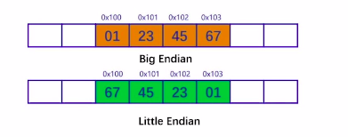

# CPP_course
This is a note for my C++ learning.

# 第1章：C++基础

## 第1节：什么是C++

- 一门比较流行的语言

- C语言的扩展

  - 关注性能

    - 与底层硬件结合紧密

      https://godbolt.org/z/xPq6e9

      

      

    - 对象生命周期精确控制

    

    对象生命周期精确控制可以节省资源，避免引入额外的开销

    

    - zero-overhead abstraction

      - 不需要为没有使用的 语言特性付出成本
        - 虚函数
        - https://godbolt.org/z/fq66hM
      - 使用了一些语言特性不等于付出运行期成本
        - https://godbolt.org/z/Pv9bWj

      

  - 引入大量特性，便于工程实践

    - 三种编程范式：面向过程，面向对象，泛型
    - 函数重载，异常处理，引用

  - 一系列不断演进的标准集合

    - c++98/03, c++11,c++14,c++17, c++20
    - 语言本身的改进
      - memory model
      - lambda expression
    - 标准库的改进
      - type_traits/ranges
      - auto_ptr

  - C++标准的工业界实现

    - MSVC、GCC、Clang
    - 每个编译器可能并不完全遵照标准
      - https://godbolt.org/z/cKMjK3
    - 不同的实现存在差异
      - https://godbolt.org/z/6hnPhY

  

## 第2节：C++开发环境与相关工具

- visual c++/gcc(g++)/clang(clang++)
- 集成开发环境:visual studio, codelite, code::blocks, eclipse
- 工具
  - /usr/bin/time
  - valgrind
  - cpp reference
  - Compiler explorer
  - c++ insights

## 第3节：C++编译、链接模型

- 简单的加工模型：

- 问题：无法处理大型程序
  - 加工耗时较长
  - 即使少量修改，也需要全部重新加工

- 解决办法：分块处理

- 好处
  - 编译耗资源但一次处理输入较少 
  - 连接输入较多但处理速度较快
  - 便于程序修改升级

- 由“分块处理”衍生出的概念 
  - 定义 、声明
  - 头文件、源文件
  - 翻译单元
    - 源文件 + 相关头文件（直接、间接）- 应湖绿的预处理语句
  - 一处定义原则：
    - 程序级：一般函数
    - 翻译单元级：内连函数、类、模板

- 预处理
  - 将源文件转换为翻译单元的过程
  - 防止头文件被循环展开
    - #ifdef解决方案
    - #pragma once决绝方案
- 编译
  - 将翻译单元转换为相应的会变语言表示
  - 编译优化
    - https://godbolt.org/z/zh9aqx
  - 增量编译 vs 全部编译

# 第2章：C++初探

## 第1节：从Hello world谈起

- 函数：一段能够反复被调用的代码，可以接收输入，进行处理并产生输出
  - 返回类型：表示了函数的返回结果的类型，可以为void
  - 函数名：用于函数调用
  - 形参列表：表示函数可以接收的参数类型，可以为空，可以为void，可以无形参
  - 函数体：具体的执行逻辑
- main函数：特殊的函数，作为整个程序的入口
  - 返回类型为Int，表示程序的返回值，通常用0来表示正常返回
  - 形参列表可以为空

- （内建）类型：为一段存储空间赋予实际的意义

- 语句：表明了需要执行的操作

## 第2节：系统I/O

- iostream:标准库所提供的IO接口，用于与用户交互
  - 输入流:cin；输出流：cout/cerr/clog
  - 输出流的区别：1. 输出目标；2. 是否立即刷新缓冲区
  - 缓冲区与缓冲区刷新：std::flush；std::endl
- 名字空间：用于防止名称冲突
  - std 名字空间
  - 访问名字空间中元素的3种方式：域名解析符:: ; using语句; 名字空间别名
  - 名字空间与名称改编 (name mangling)

- c/c++系统IO比较
  - prinf 使用直观， 但容易出错
  - cout：不容易出错，但是书写冗长
  - c++20格式化库：新的解析方案

## 第3节：猜数字与控制流

- if 语句：用于分支选择 
  - 条件部分：用于判断是否执行
  - 语句部分：要执行的操作

- ==与=操作：
  - =操作：赋值操作
  - ==操作：用于判断两个值是否相等

## 第4节：结构体与自定义数据类型

- 结构体：将相关的数据放置在一起

  - 可以通过点操作符访问内部元素
  - 可以作为函数的输入参数或返回类型
  - 可以引入成员函数，更好地表示函数与数据的相关性

  

# 第3章：对象与基本类型

## 第1节：从初始化和赋值语句谈起

- 初始化/赋值语句是程序中最基本的操作，其功能是将某个值与一个对象关联起来
  - 值：字面值，对象所表示的值...
  - 标识符：变量、常量、引用...
  - 初始化基本操作：
    - 在内存中开辟空间，保存相应的数值
    - 在编译器中构造符号表，将标识符与相关内存空间关联起来
  - 值与对象都有类型
  - 初始化/赋值可能涉及到类型转换

## 第2节：类型详述

- 类型是一个编译期概念，可执行文件中不存在类型的概念
- C++是强类型语言
- 引入类型是为了更好地描述程序，防止误用
- 类型描述了：
  - 存储所需要的尺寸（sizeof，标准并没有严格限制）
  - 取值空间（std::numeric_limits, 超过范围可能产生溢出）
  - 对齐信息
  - 可以执行的操作

- 类型可以分为基本类型和复杂类型
  - 基本（内建）类型：C++语言中所支持的类型
    - 数值类型：
      - 字符类型(char, wchar_t, char16_t, char32_t)
      - 整数类型
        - 带符号整数类型：short, int, long, long long
        - 无符号整数类型: unsigned + 带符号整数类型
      - 浮点类型
        - float, double, long double
    - void
  - 复杂类型：由基本类型组合，变种产生的类型，可能是标准库引入，或者自定义类型

- 与类型相关的标准未定义部分
  - char是否有符号
  - 整数中的内存中的保存方式：大端，小端
  - 每种类型的大小（间接影响取值范围）
    - c++11中引入了固定尺寸的整数类型，如int32_t
- 字面值及其类型
  - 字面值：在程序中直接表示为一个具体数值或者字符串的值
  - 每个字面值都有其类型
    - 整数字面值：20（十进制），024（八进制），0x14（十六进制）
    - 浮点数：1.3
    - 字符字面值：'c', '\n', -- char类型
    - 字符串字面值: "hello"
    - 布尔字面值：true, false
    - 指针字面值：nullptr 
  - 可以为字面值引入前缀或者后缀改变其类型
    - 1.3f
  - 可以引入自定义后缀来修改字面值类型
- 变量及其类型
  - 变量：对应了一段存储空间，可以改变其中的内容
  - 变量的类型在其首次声明（定义）时指定：
    - int x: 定义一个变量x, 其类型为int
    - 变量声明和定义的区别：extern 前缀
  - 变量的初始化与赋值
    - 初始化：在构造变量之初为其赋予的初始值
      - 缺省初始化
      - 直接/拷贝初始化
      - 其他初始化
    - 赋值：修改变量所保存的数值
- 隐式类型转换
  - 为变量赋值时可能涉及到类型转换
    - bool与整数之间的转换
    - 浮点数与整数之间的类型转换 
  - 隐式类型转换不只发生在赋值时
    - if 判断
    - 数值比较
      - 无符号数据与带符号数据之间的比较
      - std::cmp_XXX（c++20）

## 第3节：复合类型：从指针到引用

- 指针：一种间接类型

- 特点
  - 可以指向不同的对象
  - 具有相同的尺寸
- 相关操作
  - & - 取地址操作符
  - *- 解引用操作符

因此 

## 第4节：常量与常量表达式类型

## 第5节：类型别名与类型的自动推导

## 第6节：域与对象的生命周期

## 第7节：小节

